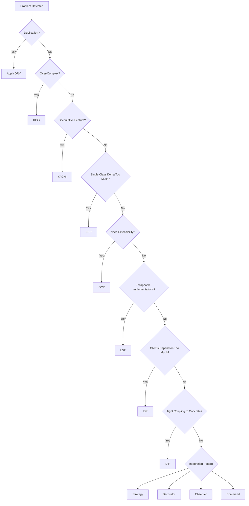

Home / Quick Reference / Decision Tree

# Decision Tree

> **One-line summary**: Choose the right principle or pattern based on observed symptoms.

## Mermaid Decision Graph

## Quick Prompts
- **Duplication** -> Extract shared module (DRY).
- **Complexity** -> Simplify (KISS) before adding patterns.
- **Speculation** -> Defer (YAGNI) and add feature flag if needed.
- **Responsibility overload** -> Split classes (SRP).
- **Variant addition** -> Implement new class, avoid switching (OCP).
- **Substitution** -> Ensure contracts hold (LSP).
- **Interface fatigue** -> Reduce surface (ISP).
- **Hard dependencies** -> Introduce abstractions (DIP).

## Laravel Tie-ins
- Use service providers as choke points for DIP.
- Contextual bindings help OCP + Strategy decisions.
- Event listeners align with Observer recommendations.

---
[Previous: Cheat Sheet](cheatsheet.md) | [Home](../README.md) | [Next: Glossary](glossary.md)
