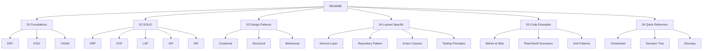

# The Software Engineer's Guide to Practical Principles

> **One-line summary**: A structured learning path for applying foundational, SOLID, and Laravel-centric engineering principles with pragmatic design patterns and testing workflows.

## Table of Contents
- [Quick Start](#quick-start)
- [Prerequisites](#prerequisites)
- [How to Use This Guide](#how-to-use-this-guide)
- [Learning Paths](#learning-paths)
- [Guide Map](#guide-map)
- [Version History](#version-history)
- [Contribution Guidelines](#contribution-guidelines)
- [Resource Links](#resource-links)

## Quick Start
- Skim `01-foundations/index.md` to align on DRY, KISS, and YAGNI fundamentals.
- Dive into `02-solid/index.md` for a SOLID refresher, then explore each principle file.
- Apply concepts with Laravel patterns in `04-laravel-specific/index.md`.
- Practice refactoring using `05-code-examples/before-after-comparisons.md`.
- Keep `06-quick-reference/cheatsheet.md` open during code reviews.

## Prerequisites
- Comfortable with PHP 8.1+ syntax and modern language features.
- Working knowledge of Laravel 10+ (routing, Eloquent, service container).
- Familiarity with Git-based workflows and PHPUnit.
- Optional but recommended: exposure to design patterns and refactoring techniques.

## How to Use This Guide
1. **Pick a learning path** below and follow the files in order using the navigation links inside each document.
2. **Practice actively** by completing exercises and code challenges; solutions are linked in the same directory.
3. **Review your own projects** with the provided checklists and self-check questions.
4. **Iterate**: revisit sections as you encounter real-world problems and compare against provided benchmarks.

## Learning Paths

| Audience | Recommended Flow | Focus Areas |
| --- | --- | --- |
| **Beginner engineer** | `01-foundations` → `02-solid` (basic sections) → `06-quick-reference` | Terminology, simple refactors, self-checks |
| **Intermediate engineer** | `01-foundations` → `02-solid` → `04-laravel-specific` → `05-code-examples` | Applying principles in Laravel apps, avoiding pitfalls |
| **Senior/Lead engineer** | `02-solid` (advanced examples) → `03-design-patterns` → `04-laravel-specific` → `05-code-examples` → `06-quick-reference/decision-tree.md` | Architectural trade-offs, performance, coaching |
| **Reviewer/Coach** | `06-quick-reference/cheatsheet.md` → `05-code-examples/anti-patterns.md` → `04-laravel-specific/testing-principles.md` | Review checklists, training materials |

## Guide Map

## Version History
- **v2.0.0 (2025-11-01)**: Migrated from single markdown file to structured multi-folder guide with expanded examples and interactive content.
- **v1.0.0**: Initial single-file article covering DRY, KISS, YAGNI, and SOLID with Laravel examples.

## Contribution Guidelines
- Follow the folder conventions (`index.md` as section overview, principle files using the shared template).
- Keep navigation elements (breadcrumbs, next/previous links) accurate when adding or reordering files.
- Prefer ASCII for diagrams unless Mermaid provides significant clarity.
- Include benchmarks or metrics when introducing new examples or refactors.
- Update the version history and relevant quick-reference materials for notable changes.

## Resource Links
- Laravel Documentation: [https://laravel.com/docs](https://laravel.com/docs)
- PHP Manual: [https://www.php.net/manual/en/](https://www.php.net/manual/en/)
- Refactoring Guru Patterns: [https://refactoring.guru/design-patterns](https://refactoring.guru/design-patterns)
- PHPUnit: [https://phpunit.de/documentation.html](https://phpunit.de/documentation.html)
- Visual Paradigm Design Patterns: [https://www.visual-paradigm.com/guide/design-patterns/](https://www.visual-paradigm.com/guide/design-patterns/)
